<div align="center">

# OG Studio

Generate branded 1200×630 social preview images for all Neorgon tools, or create custom OG images with multiple pattern styles, layouts, and brand assets.

[![Live][badge-site]][url-site]
[![HTML5][badge-html]][url-html]
[![CSS3][badge-css]][url-css]
[![JavaScript][badge-js]][url-js]
[![Claude Code][badge-claude]][url-claude]
[![License][badge-license]](LICENSE)

[badge-site]:    https://img.shields.io/badge/live_site-0063e5?style=for-the-badge&logo=googlechrome&logoColor=white
[badge-html]:    https://img.shields.io/badge/HTML5-E34F26?style=for-the-badge&logo=html5&logoColor=white
[badge-css]:     https://img.shields.io/badge/CSS3-1572B6?style=for-the-badge&logo=css3&logoColor=white
[badge-js]:      https://img.shields.io/badge/JavaScript-F7DF1E?style=for-the-badge&logo=javascript&logoColor=black
[badge-claude]:  https://img.shields.io/badge/Claude_Code-CC785C?style=for-the-badge&logo=anthropic&logoColor=white
[badge-license]: https://img.shields.io/badge/license-MIT-404040?style=for-the-badge

[url-site]:   https://ogstudio.neorgon.com/
[url-html]:   #
[url-css]:    #
[url-js]:     #
[url-claude]: https://claude.ai/code

---

</div>

## Overview

OG Studio generates branded 1200x630 social preview (Open Graph) images for all Neorgon tools. Images are rendered on `<canvas>` and exported as PNG. A custom mode allows creating OG images with arbitrary titles, subtitles, logos, layouts, and visual effects.

**Live:** [ogstudio.neorgon.com](https://ogstudio.neorgon.com/)

## Features

- 8 pattern types (constellation, dot grid, circuit lines, and more)
- Density control for pattern intensity
- Per-site accent colors matching the Neorgon brand palette
- Individual and bulk PNG download
- Custom mode for arbitrary titles and subtitles
- **5+ layout presets** (center, left, bottom, top badge, split)
- **Logo / watermark overlay** with position grid, scale, opacity, rotation, tint, and shadow
- **Custom gradient builder** with editable stops and angle, plus solid-color background
- **Enhanced typography**: text alignment, font weights, letter spacing, line height, glow
- **Visual effects**: vignette strength, grain intensity, frosted glass panel
- **Shareable URL state** — copy a link that restores the custom design
- **Undo / redo** with keyboard shortcuts (Ctrl/Cmd+Z, Ctrl/Cmd+Shift+Z/Y)
- **Remix** button to randomize style while keeping text and logo
- Optional "Made with OG Studio" badge on exports
- v1 archive accessible from the footer
- Pre-generated PNGs available in `assets/`

## Architecture



Modular ES module app following the standard project layout:

```
og-studio-site/
├── index.html          # HTML shell
├── css/
│   └── style.css       # All styles
├── js/
│   └── *.js            # ES module scripts
├── assets/             # Pre-generated OG images
└── v1/                 # Archived v1 files (read-only)
```

## Tech stack

- Pure HTML + CSS + Canvas API + JavaScript ES modules
- OG images rendered on `<canvas>` and exported as PNG
- No runtime dependencies, no build step

## Run locally

```bash
cd og-studio-site
make serve
```

Or with Python directly:

```bash
python3 -m http.server 8809
```

Then open [http://localhost:8809](http://localhost:8809). ES modules require an HTTP server (`file://` will not work).

---

<div align="center">

Part of [Neorgon](https://neorgon.com)

</div>
